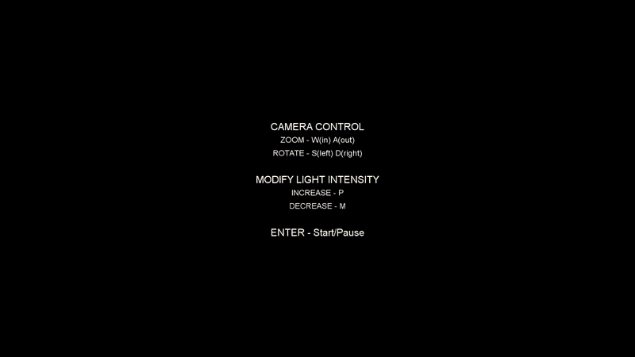

# 3D Illumination
## About the author
Miguel Herrera Álvarez. Last-year Computer Engineering student in the University of Las Palmas de Gran Canaria.

## Develop
In this project I have to create shapes with textures and illumination, so I decided to make a rack which is used in Eight-ball pool game.
Also added a camera that allow to watch the tridimensional shapes.

### Decisions
- Controls:
    - W,A,S,D keys to move the camera.
    - P,M keys to adjust the intensity of light.
    - ENTER key to start and pause.
- At the beginning and during pause appear a menu where the controls are shown.
- No external library is needed to run the code.
- Use two types of illumination, the fisrt is ambient light and the second one is point light.

## Tools and references
- [Processing 3.5.4](http://processing.org/)

## Take a peek of result

